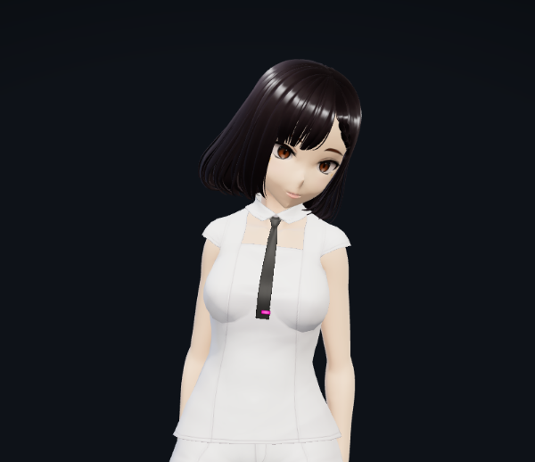
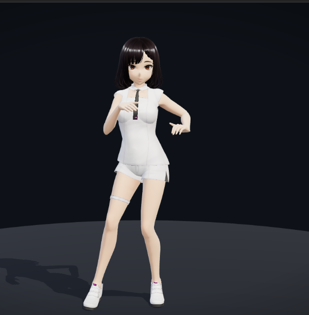

# Avatar Studio — standalone 3D avatar test app

A self-contained Vite + TypeScript + three.js application that loads the local
`anux ai 3d model.glb` VRM-style avatar, retargets 8 Mixamo FBX animation clips
onto its `J_Bip_*` skeleton at runtime, and plays them with crossfades, facial
expressions, and a developer animation test panel.

This is a **standalone test harness** — no ANUX integration.

## Screenshots

| Idle — portrait camera | Idle — natural gaze / looking around |
| --- | --- |
|  |  |



## Run it

```bash
npm install
npm run dev        # http://localhost:5173
npm run build      # regenerate registry + typecheck + production bundle
npm run preview    # serve the production build
```

## Assets

```
public/avatar/
├─ model/avatar.glb          copy of `anux ai 3d model.glb`
└─ animations/*.fbx          copies of the 8 Mixamo clips
```

**The originals in `C:\zen 3d model\` are never modified** — the app only reads
copies placed here. The originals remain as source/backup.

## Model facts (measured, not assumed)

- Plain glTF 2.0 — **not a VRM file** (no VRM extension; KHR_materials_clearcoat/specular only),
  exported via Blender with VRM-style `J_Bip_*` bone names.
- Y-up, faces +Z, feet at y=0; 1.485 m joint span (1.63 m including hair geometry).
- 1 skin "Armature" (85 joints), 3 meshes (Body / Face / Hair), 17 materials, 51 embedded textures.
- **57 facial morph targets** (`Fcl_*`): expression composites (ALL_*), brows, eyes (incl.
  `Fcl_EYE_Close` blink), 19 mouth morphs (vowels A/I/U/E/O). No jaw bone — mouth is
  morph-driven only. Eye-adjunct bones `J_Adj_L/R_FaceEye` exist; no dedicated eye bones.
- **No embedded animation clips.**

## Animation registry

`npm run build` (or `npm run registry`) regenerates `src/animation-registry.json`
via `tools/generate-animation-registry.mjs`, which parses **every FBX with
FBXLoader** and records duration, fps, bone count, root bone, landmark bones,
humanoid compatibility, and whether retargeting is required. Clips are
auto-classified (IDLE / DANCE / GREETING / SIT / REACTION / SPECIAL / OTHER)
from measured motion features only — never filenames:

- `endDrop` / `lowFraction` (hips height trajectory) → REACTION / SIT
- `energy` (mean joint angular speed, rad/s) and `hipsYAmplitude` → DANCE vs IDLE
- `endAngleDeg` (first pose vs last pose) → `kind: loop | once`

Current result: 5× DANCE, 1× IDLE, 1× SIT (Stand To Sit), 1× REACTION (Dying).
No GREETING/SPECIAL signatures exist among the provided clips.

## How the retargeting works (`src/avatar/Retarget.ts`)

Mixamo FBX clips and the avatar share no bone names, so every clip is baked
onto the avatar rig when the app boots:

1. For each mapped bone pair, capture both rigs' **rest world rotations**.
2. Sample the source clip at 30 fps with an `AnimationMixer` on the FBX scene.
3. For each sample, the target bone's world rotation is
   `S_world · (S_rest⁻¹ · T_rest)` — the source's world-relative motion applied
   on top of the target's rest. At source rest the target sits exactly at its
   own rest, and the target mesh mirrors the source mesh's world motion 1:1,
   regardless of how differently the two rigs orient their bind bones (the
   VRM head differs from the Mixamo head by ~95°).
4. Hip translation is copied in world space scaled by the ratio of hip heights
   (cancels Mixamo's centimeter units and proportion differences). Horizontal
   travel is stripped (`IN_PLACE_ROOT_MOTION`) so dances stay centered.
5. Samples are baked into fresh tracks bound to the `J_Bip_*` names, with
   quaternion sign-continuity fixes, then played as plain `AnimationMixer` clips.

## Architecture

```
src/
├─ main.ts                  app bootstrap, camera framing, wiring
├─ config.ts                asset paths, bone map, expression presets, registry types
├─ animation-registry.json  generated from the FBX files (source of truth)
├─ core/SceneManager.ts     renderer, lights, ground, OrbitControls, render loop,
│                           frameBox() — camera distance derived from box + fov
├─ avatar/
│  ├─ AvatarLoader.ts       GLB loading + normalization (feet on y=0, centered)
│  ├─ Retarget.ts           Mixamo → J_Bip retarget baker (see above)
│  ├─ ClipLibrary.ts        loads each FBX, bakes clips, disposes sources
│  ├─ AnimationManager.ts   playAnimation / crossFadeTo / stopAnimation /
│  │                        resetAnimation / setLoopMode / backToIdle / setSpeed;
│  │                        single active clip (no fighting over bones),
│  │                        auto-return to idle after one-shots, rest-pose restore
│  └─ Expressions.ts        Fcl_* morph presets with smooth blending + auto-blink
└─ ui/
   ├─ UIController.ts       dev test panel DOM wiring
   └─ LoadingUI.ts          loading overlay + error toast
```

### Camera framing (Phase 6)

`main.ts` computes framing from the avatar's **actual bounds and head-bone
height** (never hardcoded positions): *Portrait cam* frames face + head + chest
+ upper body (default on boot); *Full body cam* frames the whole character with
margin — ready for dance animations. `SceneManager.frameBox()` derives distance
from box size and camera fov.

### Developer animation test panel (Phase 7)

Select an animation (or keys `1–8`), then **Play / Stop / Reset**, a Loop mode
override (Default/Loop/Once), speed slider (0.25–2×), Pause, "Back to idle",
a live **Now playing** readout, and per-clip metadata (category, duration,
loop/once, hotkey).

`window.__avatarTest` exposes `{ manager, expressions, avatar, sceneManager,
frameCamera }` for debugging and automated tests.

## Natural behavior system (Phase 2)

The character is never a static model. All procedural motion is **additive on
top of the active clip** (applied after the mixer update each frame, gated to
run only while the idle clip is active, so it can never fight dances):

- `src/avatar/BehaviorLayer.ts` — breathing (chest + shoulders + subtle hip bob),
  slow figure-eight body sway, randomized weight shifts (8–18 s), gaze (head
  yaw/pitch toward the camera with saccade jitter, or wandering points), head
  micro-motion from non-repeating noise, and a **weighted behavior scheduler**
  (look away, smile flicker, double blink, curious/playful tilt, nod,
  thinking moment, shrug, look down) with per-behavior cooldowns, recency
  penalties, and randomized gaps (2.8–6.8 s × emotion energy) — nothing runs at
  fixed intervals. Eye gaze uses the `J_Adj_*_FaceEye` adjust bones
  (±5° micro-rotation) plus head-look; the rig has no dedicated eye bones.
- `src/avatar/Expressions.ts` + `Emotions.ts` — morph engine with smooth
  blending; 10 emotions (NEUTRAL/HAPPY/SAD/ANGRY/SURPRISED/CURIOUS/THINKING/
  EXCITED/CALM/PLAYFUL) built strictly from the GLB's real `Fcl_*` morphs, each
  also driving breath rate, sway energy, gaze bias, blink rate, and head
  posture. Temporary overlays (smile flickers, reaction faces) merge over the
  emotion base.
- `src/avatar/Reactions.ts` — choreographed cues: GREETING (camera gaze + smile
  + nod + blink), SURPRISED (eyes widen + head pull-back), HAPPY/SAD/ANGRY/
  THINKING (emotion + head cue). Head cues are skipped during dances.
- `src/avatar/DanceSystem.ts` — `trigger("dance")` picks a registry DANCE clip
  with weighted randomness; the two most recent dances are down-weighted to 12%,
  so repeats never chain. Loop count is randomized; the dance ends back in idle.
- `src/avatar/AvatarBrain.ts` — state/priority machine:
  `DANCE > GREETING > REACTION > IDLE`. Idle behavior can never interrupt
  anything (it only runs in IDLE); GREETING is refused during DANCE; reactions
  during a dance are face-only.
- `src/core/CameraRig.ts` — Normal / Full Body / Auto camera modes. Framing is
  computed from model bounds + head-bone height; every reframe is a smoothstep
  tween (~1.1–1.3 s), never a teleport. Auto switches to full-body on dance and
  back on idle.

## Speech / lip-sync (Phase 3)

`src/avatar/LipSyncController.ts` — independent from ANUX, designed to accept
the future TTS output:

- **Primary path** — viseme timeline: `start({ visemeTimeline: [{ time, viseme,
  intensity }] })`. Keys are interpolated and blended into morph targets each
  frame (smooth crossfade between visemes, never OPEN/CLOSE snapping).
- **Fallback path** — `start({ audioBuffer | audioUrl })`: an AnalyserNode drives
  mouth openness from RMS amplitude and picks the vowel from the spectral
  centroid with hysteresis (no vowel flicker). Volume-based opening is a
  fallback only.
- **Dev test** — `start({ synthetic: true, syntheticSpeed, syntheticDurationS })`
  generates a speech-like timeline (syllables, consonant bursts, phrase pauses);
  `createBabbleBuffer()` synthesizes test audio for the fallback path.

Viseme set adapted to what the model actually provides (verified): vowels
`Fcl_MTH_A/I/U/E/O`, closure `Fcl_MTH_Close`, plus `MTH_Up/Down/Small` for
consonant approximations (M/F/L/S/CH/R/TH). **The model has no jaw bone, no
tongue/teeth bones, and no eye bones** — jaw motion is inherent to the mouth
morphs, and gaze uses the eye-adjunct bones plus head-look.

`SPEAKING` state (priority DANCE > GREETING > REACTION > SPEAKING > IDLE):
mouth morphs merge over the emotion base with `max()` blending, so
blinking, gaze, emotions, and head emphasis (syllable-peak micro-nods +
occasional tilts from the lip-sync energy) all stay live during speech. Stop
fades the mouth closed — it can never stick open.

### Public API (future ANUX seam — not wired to anything)

```js
avatar.setState("IDLE" | "GREETING" | "DANCE")
avatar.setEmotion("HAPPY" | "SAD" | ... )
avatar.react("GREETING" | "SURPRISED" | ...)
avatar.trigger("dance")
avatar.startSpeaking({ visemeTimeline } | { audioBuffer | audioUrl } | { synthetic: true })
avatar.stopSpeaking()
avatar.setMusicState(true | false)   // music signal from the host music system
```

## Music activity → automatic dance (Phase 4)

- `src/avatar/MusicActivityDetector.ts` — reusable, ANUX-independent signal
  source. Two modes: **external signal** (`setMusicState(true/false)` — for a
  host whose own system already classified the audio) and **built-in
  analysis** (`connectAudioSource(node | MediaStream | HTMLAudioElement)` or
  `attachAnalyser(...)` + `start()`). Analysis smooths RMS/bass-ratio features
  and uses hysteresis: activation needs sustained level + bass content for
  ~1.2 s; deactivation needs ~2.5 s of silence — no START/STOP chatter from
  spikes. Emits `start`/`stop` events; exposes `isMusicActive()`,
  `getLevel()`, `getEnergyBand()` (low/medium/high). One shared AudioContext;
  analysis runs on the shared render loop with zero per-frame allocation.
- `src/avatar/MusicController.ts` — owns the detector, forwards events to the
  brain, provides the dev test signal (`startAnalysisTest()` — a synthesized
  120 BPM kick/hat/bass loop; **not a music player**).
- `AvatarBrain` music handling: music start interrupts SPEAKING (priority),
  queues behind GREETING/REACTION, and while music stays active dances chain
  into fresh weighted selections; music stop gives the current dance a short
  natural ending (~2 s) before the crossfade to IDLE. Manual commands
  (forced IDLE / manual dance) take priority; a manual IDLE suppresses
  music-dancing until the next music state change.
- `DanceSystem.pick(targetEnergy)` — energy-biased selection using the
  registry's measured motion energy (relaxed/normal/energetic music → matching
  dance intensity; selection bias only, no exaggerated motion).

## Tools (`tools/`)

- `inspect-assets.mjs` — GLB JSON chunk + FBX header/string analysis (read-only)
- `inspect-rest-pose.mjs` — GLB rest-pose TRS math (heights, arm/leg directions)
- `debug-fbx-names.mjs` — dumps FBXLoader node/track names (FBXLoader strips `:`)
- `generate-animation-registry.mjs` — builds the animation registry (see above)
